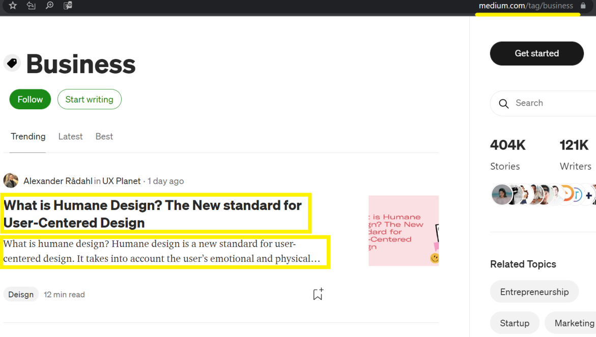
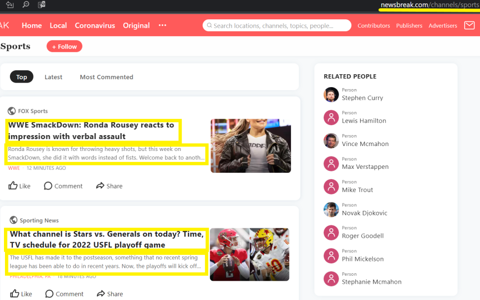
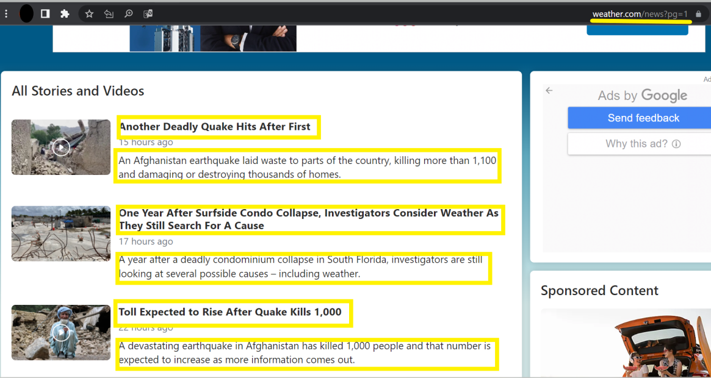
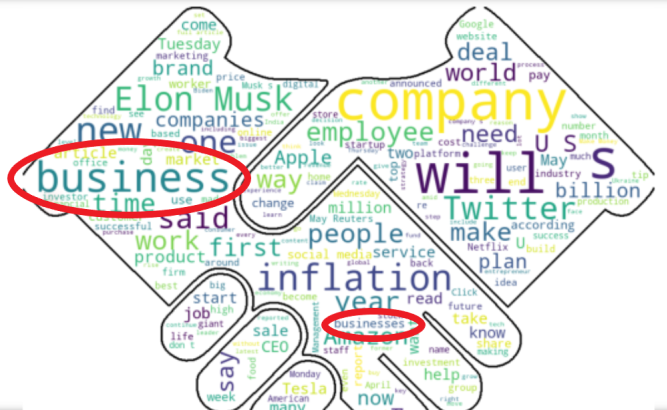
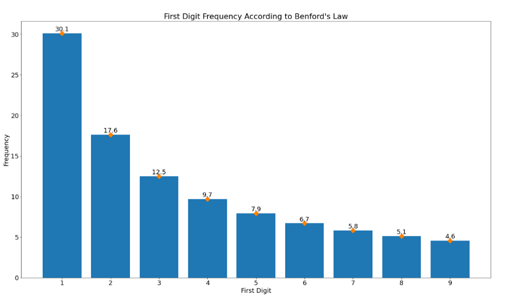
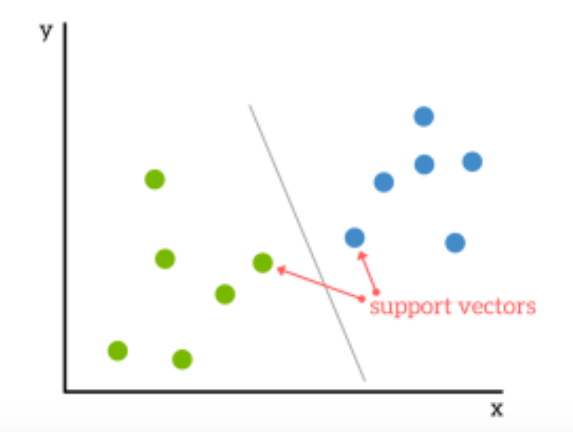

# 1.0 Introduction

Assuming we have small or large text and we want to know which category the text belongs, how can we predict what the subject of the text is?  
This question is related to the problem of classification, a classification problem is when the output variable is a category, In our scenario the output variable it's like "politics, "food", "science" etc.

In this project we present a model that deals with the classification problem.
To solve the text classification problem we set a goal to our research: to see if we can build a model that will classify the subject of the text according to the frequency of words in each category. 

In our research we focus on 7 categories:

* Technology  
* Politics
* Sports
* Entertainment
* Weather
* Science
* Business
* Food


## Table of Contents

1. [Introduction](#10-introduction)  
2. [Requirements and Imports](#20-requirements-and-imports)  
2.1 [Requirements](#21-requirements)  
2.2 [Imports](#22-imports)  
3. [Data Acquision](#30-data-acquision)  
3.1. [Resources](#31-resources)  
&nbsp;&nbsp;&nbsp;&nbsp;3.1.1 [Medium](#311-medium)  
&nbsp;&nbsp;&nbsp;&nbsp;3.1.2 [Hubpages](#312-hubpages)  
&nbsp;&nbsp;&nbsp;&nbsp;3.1.3 [Newsbreak](#313-newsbreak)  
&nbsp;&nbsp;&nbsp;&nbsp;3.1.4 [Weather.com](#314-weathercom)  
&nbsp;&nbsp;&nbsp;&nbsp;3.1.5 [Siencenews](#315-sciencenews)  
&nbsp;&nbsp;&nbsp;&nbsp;3.1.6 [Food52](#316-food52)  
3.2 [Data Acquision Results](#32-data-acquision-results)  
4. [Data Cleaning](#40-data-cleaning)  
4.1 [Remove Unnecessary Columns](#41-remove-unnecessary-columns)  
4.2 [Remove Null Objects](#42-remove-null-objects)  
4.3 [Remove Duplicate Rows](#43-remove-duplicate-rows)  
5. [EDA](#50-eda)  
5.1 [Merged header and content](#51-merged-header-and-content)  
5.2 [Visualization Vol.1](#52-visualization-vol1)  
&nbsp;&nbsp;&nbsp;&nbsp;5.2.1 [Pie Chart](#521-pie-chart)  
&nbsp;&nbsp;&nbsp;&nbsp;5.2.2 [WordCloud](#522-wordcloud)  
&nbsp;&nbsp;&nbsp;&nbsp;5.2.3 [Top 10 words](#523-top-10-words)  
&nbsp;&nbsp;&nbsp;&nbsp;5.2.4 [Distribution of Words](#524-distribution-of-words)  
&nbsp;&nbsp;&nbsp;&nbsp;5.2.5 [Conclustion](#525-conclustion)  
5.3 [Remove Text with Short Content](#53-remove-text-with-short-content)  
5.4 [Banford's Law](#54-banfords-law)  
5.5 [Remove Numbers \n and \r from Text](#55-remove-numbers-n-and-r-from-text)  
5.6 [Remove non-english Texts](#56-remove-non-english-texts)  
5.7 [Remove Special Characters](#57-remove-special-characters)  
5.8 [Lemmatization and POS](#58-lemmatization-and-pos)  
5.9 [Dataframe Lowercase](#59-dataframe-lowercase)  
5.10 [Remove Stopwords](#510-remove-stopwords)  
5.11 [Visualization Vol.2](#511-visualization-vol2)  
&nbsp;&nbsp;&nbsp;&nbsp;5.11.1 [Pie Chart](#5111-pie-chart)  
&nbsp;&nbsp;&nbsp;&nbsp;5.11.2 [WordCloud](#5112-wordcloud)  
&nbsp;&nbsp;&nbsp;&nbsp;5.11.3 [Top 10 Words](#5113-top-10-words)  
&nbsp;&nbsp;&nbsp;&nbsp;5.11.4 [Distribution of Words](#5114-distribution-of-words)  
5.12 [Final EDA Conclustion](#512-final-eda-conclustion)  
6. [Vectorization and Machine Learning](#60-vectorization-and-machine-learning)  
6.1 [Vectorization](#61-vectorization)  
6.2 [Multinomial NB](#62-multinomial-nb)  
&nbsp;&nbsp;&nbsp;&nbsp;6.2.1 [Confusion Matrix](#621-confusion-matrix)  
&nbsp;&nbsp;&nbsp;&nbsp;6.2.2 [Cross Validation](#622-cross-validation)  
6.3 [SVM Classifier](#63-svm-classifier)  
&nbsp;&nbsp;&nbsp;&nbsp;6.3.1 [Confusion Matrix](#631-confusion-matrix)  
&nbsp;&nbsp;&nbsp;&nbsp;6.3.2 [Cross Validation](#632-cross-validation)  
7.0 [Project Conclustion](#70-project-conclustion)    


# 2.0 Requirements and Imports

## 2.1 Requirements

In our project we use these python packages:

```
pandas
numpy
matplotlib
beatifulsoup
nltk
sklearn
seaborn
selenium
langdetect
wordcloud
```

**selenium** - The selenium package is used to automate web browser interaction from Python. For more details click [here](https://pypi.org/project/selenium/).  

**langdetect** - Google's language-detection library. For more details click [here](https://pypi.org/project/langdetect/).  

**wordcloud** - Word Cloud is a data visualization technique used for representing text data in which the size of each word indicates its frequency or importance. For more details click [here](https://pypi.org/project/wordcloud/).  

## 2.2 Imports


```python
import os
import re
import bs4
import time
import requests
import pandas as pd
import numpy as np
from os import listdir
from datetime import date
from bs4 import BeautifulSoup  
from os.path import isfile, join

# --- selenium libraries
from selenium import webdriver
from selenium.webdriver.common.by import By
from selenium.webdriver.common.keys import Keys
from selenium.webdriver.chrome.service import Service

# language detector
from langdetect import detect
from langdetect import detect_langs

# Wordcloud visualization
import seaborn as sns
import itertools
import collections
from PIL import Image
import matplotlib.cm as cm
import matplotlib.pyplot as plt
from matplotlib import rcParams
from wordcloud import WordCloud, STOPWORDS
%matplotlib inline

# nltk
import nltk
import nltk.corpus
from nltk import word_tokenize
from nltk.corpus import wordnet
from nltk.corpus import stopwords
from nltk.stem import WordNetLemmatizer
from nltk import pos_tag, Tree
nltk.download("stopwords")
nltk.download('averaged_perceptron_tagger')

# sklearn
from sklearn import svm
from sklearn import metrics
from sklearn import preprocessing
from sklearn.naive_bayes import MultinomialNB
from sklearn.datasets import fetch_20newsgroups
from sklearn.datasets import make_classification
from sklearn.metrics import plot_confusion_matrix
from sklearn.ensemble import RandomForestClassifier
from sklearn.model_selection import train_test_split
from sklearn.feature_extraction.text import CountVectorizer
from sklearn.model_selection import cross_val_score,StratifiedKFold

# Handle warnings
import warnings
warnings.filterwarnings('ignore')


```

    [nltk_data] Downloading package stopwords to
    [nltk_data]     C:\Users\efi13\AppData\Roaming\nltk_data...
    [nltk_data]   Package stopwords is already up-to-date!
    [nltk_data] Downloading package averaged_perceptron_tagger to
    [nltk_data]     C:\Users\efi13\AppData\Roaming\nltk_data...
    [nltk_data]   Package averaged_perceptron_tagger is already up-to-
    [nltk_data]       date!
    

# 3.0 Data Acquision

Data acquisition meaning is to collect data from relevant sources before it can be cleaned, preprocessed, and used for further mechanisms.  
In this part of the project we will acquire articles from different sites for train our model.  

## 3.1 Resources


This is all our resources sites:
    
* [medium]("https://medium.com/")
* [hubpages]("https://discover.hubpages.com/")
* [newsbreak]("https://www.newsbreak.com/channels/sports")
* [sceinceNews]("https://www.sciencenews.org/")
* [weather.com]("https://weather.com")
* [food52]("https://food52.com/")


### 3.1.1 Medium


`Medium` is a social publishing platform that is open to all and home to a diverse array of stories, ideas, and perspectives. Anyone can be an individual contributor, and popular topics on Medium range from mental health to social media, and from world affairs and trending news to productivity hacks. 

From medium site we extract these categories:

* Technology
* Politics
* Sports
* Entertainment
* Weather
* Science
* Business
* Food



**The difficulties from this site:**

The difficulties in `Medium` were that in order to load more articles on the site, the program should scroll down in order to load new articles. 


```python
#chromedriver.exe for windows users!
```


```python
def get_infinity_page_html_data(chromedriver_path="./chromedriver.exe", scroll_number=1, sleep_time=3):
    # Create selenium driver
    s = Service(chromedriver_path)
    driver = webdriver.Chrome(service=s)    
    driver.get(url)
    
    for i in range(1,scroll_number):
        print(f"scroll_number: {i}")
        driver.execute_script("window.scrollTo(1,50000)")
        time.sleep(sleep_time)
    html_data = driver.page_source
    driver.close()
    
    return html_data
```


```python
def extract_medium_articles_from_HTML_data(html_data):
    # Extract articles from HTML data 
    soup = BeautifulSoup(html_data, 'html.parser')    
    articles = soup.find_all("article")
    print(f"Number of articles: {len(articles)}")
    
    return articles
```


```python
def create_df_from_articles(articles,category):    
    # Create a lists for df
    categories = []
    headers = []
    contents = []
    for article in articles:
        headers.append(article.find("h2").get_text()) 
        categories.append(category)
        
        if category == "politics" or category == "food":
            content = article.find("p", {"class": lambda L: L and L.startswith('lj b do dp')})        
        if category == "sports" or category == "technology" or category == "weather":
            content = article.find("p", {"class": lambda L: L and L.startswith('lf b do dp')})
        if category == "entertainment":
            content = article.find("p", {"class": lambda L: L and L.startswith('lg b do dp')})
        if category == "business" or category == "science":
            content = article.find("p", {"class": lambda L: L and L.startswith('li b do dp')})
        
        if content is not None:
            contents.append(content.get_text())
        else:
            contents.append(content)        
        
    return pd.DataFrame(
        {"category": categories,  
         "header": headers,
         "content": contents})
```


```python
categories = ["technology", "politics", "sports", "entertainment", "weather", "science", "business", "food"]

for category in categories:     
    url = f"https://medium.com/tag/{category}"
    html_data = get_infinity_page_html_data(scroll_number=10)
    articles = extract_medium_articles_from_HTML_data(html_data)
    df = create_df_from_articles(articles, category)
    print(df.shape)
    
    df.to_csv(f"./csv_files/medium_{category}_{date.today()}.csv") 
```

### 3.1.2 Hubpages

`HubPages` is an American online publishing platform was launched in 2006. Members post informational articles and earn a share of the income from those articles through the HubPages Earnings Program.


From medium site we extract these categories:

* Technology
* Politics
* Sports
* Entertainment
* Business
* Food


**The difficulties from this site:**  
The difficulties in `Hubpages` are that in order to load more articles on the site, the program shuold tap the “show more” button  at the bottom of the webpage.


```python
def get_page_html_data_with_see_more_option(url, chromedriver_path="./chromedriver.exe", numbers_of_see_more_clicks=1, sleep_time=3):
    # Create selenium driver
    service = Service(chromedriver_path)
    driver = webdriver.Chrome(service=service)    
    driver.get(url)
    driver.maximize_window()

    for i in range(1,numbers_of_see_more_clicks+1):                
        button_xpath = "//button[@class='m-footer-loader--button m-component-footer--loader m-button']"                
        driver.execute_script("window.scrollTo(0, document.body.scrollHeight);")
        time.sleep(sleep_time)
        print(f"Numbers of clicks: {i}")
        driver.find_element(by=By.XPATH, value=button_xpath).click()                    
        time.sleep(sleep_time)
        
    html_data = driver.page_source
    driver.close()
    
    return html_data
```


```python
def extract_hubpages_articles_from_HTML_data(html_data):        
    # Extract articles from HTML data 
    soup = BeautifulSoup(html_data, 'html.parser')    
    articles = soup.find_all("div", {"class": "m-card--content"})          
    
    return articles
```


```python
def create_df_from_articles(articles, category):    
    # Create a lists for df
    categories = []
    headers = []
    contents= []

    for article in articles:
        categories.append(category)
        headers.append(article.find("h2").get_text())
        content = article.find("p", {"class": "m-card--body m-ellipsis--text"})
        if content is not None:
            contents.append(content.get_text())            
        else:
            contents.append(content)                
        
    return pd.DataFrame(
        {"category": categories,  
         "header": headers, 
         "contents": contents})
```


```python
#"science", "weather" - doesnt exists
categories = ["politics", "sports", "food", "entertainment", "business", "technology"]
categories = ["entertainment", "business", "technology"]
for category in categories: 
    url = f"https://discover.hubpages.com/{category}/"
    html_data = get_page_html_data_with_see_more_option(url, numbers_of_see_more_clicks=10)
    articles = extract_hubpages_articles_from_HTML_data(html_data)
    df = create_df_from_articles(articles, category)    
    df.to_csv(f"./csv_files/hubpages_{category}_{date.today()}.csv")
    print(df.shape)    
```

### 3.1.3 Newsbreak

`Newsbreak` is an online news and current affairs magazine published in the Philippines. It began as a weekly print magazine that was published from January 24, 2001, to 2006. The Newsbreak website, launched in 2006, now functions as the investigative and research arm of online news organization Rappler.

From medium site we extract these categories:

* Technology
* Politics
* Sports
* Entertainment
* Weather
* Science
* Business




**The difficulties from this site:**  
The difficulties in `Newsbreak` were that in order to load more articles on the site, the program shuold scroll down in order to load new article.  


```python
def get_infinity_page_html_data(chromedriver_path="./chromedriver.exe", scroll_number=1, sleep_time=3):
    # Create selenium driver
    service = Service(chromedriver_path)
    driver = webdriver.Chrome(service=service)    
    driver.get(url)
    
    for i in range(1,scroll_number+1):
        print(f"scroll_number: {i}")
        driver.execute_script("window.scrollTo(1,50000)")
        time.sleep(sleep_time)
    html_data = driver.page_source
    driver.close()
    
    return html_data
```


```python
def extract_newsbreak_articles_from_HTML_data(html_data):
    # Extract articles from HTML data 
    soup = BeautifulSoup(html_data, 'html.parser')    
    articles = soup.find_all("article")
    print(f"Number of articles: {len(articles)}")        
    
    return articles
```


```python
def create_df_from_articles(articles,category):    
    # Create a lists for df
    categories = []
    headers = []
    contents= []
        
    for article in articles:            
        categories.append(category)        
        headers.append(article.find("a", {"class": lambda L: L and L.startswith('ContentCardBody_title')}).get_text())                           
        contents.append(article.find("div", {"class": lambda L: L and L.startswith('ContentCardBody_summary')}).get_text())    
    
    return pd.DataFrame(
        {"categories": categories,  
         "headers": headers, 
         "contents": contents})
```


```python
# "food" - doesnt exists
categories = ["technology","politics", "sports", "science", "entertainment", "business", 'weather']
for category in categories: 
    url = f"https://www.newsbreak.com/channels/{category}"    
    html_data = get_infinity_page_html_data(scroll_number=10)
    articles = extract_newsbreak_articles_from_HTML_data(html_data)
    df = create_df_from_articles(articles,category)
    df.to_csv(f"./csv_files/newsbreak_{category}_{date.today()}.csv")
    print(df.shape)
    print()
```

### 3.1.4 Weather.com

`The Weather Channel (TWC)` is an American pay television channel owned by Weather Group, LLC, a subsidiary of Allen Media Group. The Weather Channel was a subsidiary of the Weather Company until the latter was bought by IBM in 2016. The Weather Channel licenses its weather data from IBM.

From medium site we extract these categories:  
* Weather




```python
def extract_articles_HTML(url):
    request = requests.get(url)
    return BeautifulSoup(request.content, 'html.parser')
    
```


```python
def create_weather_news_df(url,page):
    header = []
    content = []
    category = []
    for i in range(page,page+1):
        time.sleep(3)
        try:
            url = url+f"{i}"
            soup = extract_articles_HTML(url)


            main_content = soup.find("div",{"id":lambda L: L and L.startswith('WxuCollectionMediaList-main')})
            li_lst = main_content.find_all("li")
            print(f"page number: {i}")            
            for li in li_lst:
                header.append(li.find("div",
                                       {"class":lambda L: L and L.startswith('CollectionMediaList--title')}).get_text())
                content.append(li.find("div",
                                       {"class":lambda L: L and L.startswith('CollectionMediaList--caption')}).get_text())
                category.append("weather")
            
        except:
            print(f"error in page {i}")
    return pd.DataFrame({"category":category, "header":header, "content":content})

```


```python
df = create_weather_news_df('https://weather.com/news?pg=',1)
for i in range(2,201):
    df = df.append(create_weather_news_df('https://weather.com/news?pg=',i))
    time.sleep(4)
    print(df.shape)
df.to_csv(f"./csv_files/weather_com_{date.today()}.csv")
```

### 3.1.5 ScienceNews

`Science News (SN)`, abbreviated on its website as Sci News, is an American bi-weekly magazine devoted to short articles about new scientific and technical developments, typically gleaned from recent scientific and technical journal.

From medium site we extract these categories:  
* Science


```python
def create_science_news_df(url,page):
    header = []
    content = []
    category = []

    for i in range (page,page+1):
        time.sleep(3)
        try:
            print(f"page number: {i}")
            url = url + f'{i}'
            soup = extract_articles_HTML(url)

            main_content = soup.find_all("ol")[0]
            li_lst = main_content.find_all("li")

            for li in li_lst:
                category.append("science")
                header.append(li.find("h3").get_text().strip())
                content.append(li.find("p").get_text().strip())


        except:
            print(f"error in page {i}")


    return pd.DataFrame({"category":category, "header":header, "content":content})
```


```python
df = create_science_news_df('https://www.sciencenews.org/topic/science-society/page/',1)
for i in range(2,81):
    df = df.append(create_science_news_df('https://www.sciencenews.org/topic/science-society/page/',i))
    time.sleep(4)
    print(df.shape)
```


```python
df.to_csv(f"./csv_files/science_news_{date.today()}.csv")
```

### 3.1.6 Food52

On `Food52` you can find thousands of recipes submitted by it’s community and cooked by it’s editors in their own test kitchens.

From medium site we extract these categories:  
* Food


```python
def create_food_news_df(url,page):
    header = []
    content = []
    category = []

    for i in range (page,page+1):
        time.sleep(3)
        try:
            print(f"page number: {i}")
            url = url + f'{i}'
            soup = extract_articles_HTML(url)

            content_lst = soup.find_all("div",{"class":"tag-post__body"})
            for item in content_lst:
                category.append("food")
                header.append(item.find("h3").get_text().strip())
                content.append(item.find("p").get_text().strip())

        except:
            print(f"error in page {i}")


    return pd.DataFrame({"category":category, "header":header, "content":content})
```


```python
df = create_food_news_df('https://food52.com/tags/food-news?page=',1)
for i in range(2,45):
    df = df.append(create_food_news_df('https://food52.com/tags/food-news?page=',i))
    time.sleep(4)
    print(df.shape)
```


```python
df.to_csv(f"./csv_files/food52_news_{date.today()}.csv")
```

## 3.2 Data Acquision Results


In the previous section we collect articles from several sites.  
For each site we create a `.csv` file.  
In this section we merged all `.csv` files into `merged_csv.csv` file.


```python
#create a list of all file names
file_names_list = [f for f in listdir('./csv_files/') if isfile(join('./csv_files/', f))]
```


```python
temp_df = pd.read_csv(f'./csv_files/{file_names_list[0]}')
temp_df.columns = ['Unnamed: 0', 'category', 'header', 'content']
merged_df = temp_df.copy()
print("before:",merged_df.shape)

for i in range(1,len(file_names_list)):
    temp_df = pd.read_csv(f'./csv_files/{file_names_list[i]}')
    #change in each df to the same column names
    temp_df.columns = ['Unnamed: 0', 'category', 'header', 'content']
    merged_df = merged_df.append(temp_df)
    
print("after:",merged_df.shape)    
```

    before: (612, 4)
    after: (31113, 4)
    


```python
merged_df.to_csv('merged_csv.csv')
merged_df.info()
```

    <class 'pandas.core.frame.DataFrame'>
    Int64Index: 31113 entries, 0 to 1999
    Data columns (total 4 columns):
     #   Column      Non-Null Count  Dtype 
    ---  ------      --------------  ----- 
     0   Unnamed: 0  31113 non-null  int64 
     1   category    31113 non-null  object
     2   header      31113 non-null  object
     3   content     26029 non-null  object
    dtypes: int64(1), object(3)
    memory usage: 1.2+ MB
    

As you can see, we collect **31607 articles**.

# 4.0 Data Cleaning


In this section we clean unnecessary data like nan values and duplicate rows.  
There are two types of cells:
1. A cell that presents research and insights about the data information.
2. A cell that changes the `df` according to the specific insight.


```python
df = pd.read_csv("./merged_csv.csv")
```

## 4.1 Remove Unnecessary Columns


```python
print(df.shape)
df.head()
```

    (31113, 5)
    


<div>
<style scoped>
    .dataframe tbody tr th:only-of-type {
        vertical-align: middle;
    }

    .dataframe tbody tr th {
        vertical-align: top;
    }

    .dataframe thead th {
        text-align: right;
    }
</style>
<table border="1" class="dataframe">
  <thead>
    <tr style="text-align: right;">
      <th></th>
      <th>Unnamed: 0</th>
      <th>Unnamed: 0.1</th>
      <th>category</th>
      <th>header</th>
      <th>content</th>
    </tr>
  </thead>
  <tbody>
    <tr>
      <th>0</th>
      <td>0</td>
      <td>0</td>
      <td>food</td>
      <td>161,692 Pounds of Skippy Peanut Butter Have Be...</td>
      <td>Three kinds of peanut butter have been recalle...</td>
    </tr>
    <tr>
      <th>1</th>
      <td>1</td>
      <td>1</td>
      <td>food</td>
      <td>Impossible Foods Sausage Links Are the Plant-B...</td>
      <td>The impossible is now possible!</td>
    </tr>
    <tr>
      <th>2</th>
      <td>2</td>
      <td>2</td>
      <td>food</td>
      <td>Goodbye to Chowhound, the Internet’s First Foo...</td>
      <td>This 25-year-old corner of the culinary intern...</td>
    </tr>
    <tr>
      <th>3</th>
      <td>3</td>
      <td>3</td>
      <td>food</td>
      <td>Thank You, Mr. Entenmann, for the Nicest Cake ...</td>
      <td>Charles Entenmann was the center of our daily ...</td>
    </tr>
    <tr>
      <th>4</th>
      <td>4</td>
      <td>4</td>
      <td>food</td>
      <td>How Home Cooks Are Supporting Ukrainians Right...</td>
      <td>Around the world, home cooks are using bake sa...</td>
    </tr>
  </tbody>
</table>
</div>


In the df above we have two unnecessary columns:
```
Unnamed: 0
Unnamed: 0.1
```
Let's drop these two columns.


```python
# Romove df columns
df.drop(columns="Unnamed: 0", axis=1, inplace=True)
df.drop(columns="Unnamed: 0.1", axis=1, inplace=True)
```


```python
df
```


<div>
<style scoped>
    .dataframe tbody tr th:only-of-type {
        vertical-align: middle;
    }

    .dataframe tbody tr th {
        vertical-align: top;
    }

    .dataframe thead th {
        text-align: right;
    }
</style>
<table border="1" class="dataframe">
  <thead>
    <tr style="text-align: right;">
      <th></th>
      <th>category</th>
      <th>header</th>
      <th>content</th>
    </tr>
  </thead>
  <tbody>
    <tr>
      <th>0</th>
      <td>food</td>
      <td>161,692 Pounds of Skippy Peanut Butter Have Be...</td>
      <td>Three kinds of peanut butter have been recalle...</td>
    </tr>
    <tr>
      <th>1</th>
      <td>food</td>
      <td>Impossible Foods Sausage Links Are the Plant-B...</td>
      <td>The impossible is now possible!</td>
    </tr>
    <tr>
      <th>2</th>
      <td>food</td>
      <td>Goodbye to Chowhound, the Internet’s First Foo...</td>
      <td>This 25-year-old corner of the culinary intern...</td>
    </tr>
    <tr>
      <th>3</th>
      <td>food</td>
      <td>Thank You, Mr. Entenmann, for the Nicest Cake ...</td>
      <td>Charles Entenmann was the center of our daily ...</td>
    </tr>
    <tr>
      <th>4</th>
      <td>food</td>
      <td>How Home Cooks Are Supporting Ukrainians Right...</td>
      <td>Around the world, home cooks are using bake sa...</td>
    </tr>
    <tr>
      <th>...</th>
      <td>...</td>
      <td>...</td>
      <td>...</td>
    </tr>
    <tr>
      <th>31108</th>
      <td>weather</td>
      <td>Colorado Avalanches Bury Cars, Roadways; Backc...</td>
      <td>Avalanches closed highways and buried cars thi...</td>
    </tr>
    <tr>
      <th>31109</th>
      <td>weather</td>
      <td>Alabama Gov. Kay Ivey Views EF4 Tornado Damage...</td>
      <td>The Alabama town of Beauregard continues to re...</td>
    </tr>
    <tr>
      <th>31110</th>
      <td>weather</td>
      <td>Alabama Tornado Victims: Funerals Begin for th...</td>
      <td>Four children are among the 23 people who died...</td>
    </tr>
    <tr>
      <th>31111</th>
      <td>weather</td>
      <td>NASA Captures First Images of Intersecting Sho...</td>
      <td>Using advanced photographic technology, NASA h...</td>
    </tr>
    <tr>
      <th>31112</th>
      <td>weather</td>
      <td>Louisville Zoo Closed Another Day by Giant Sin...</td>
      <td>The sinkhole, almost the size of a football fi...</td>
    </tr>
  </tbody>
</table>
<p>31113 rows × 3 columns</p>
</div>


## 4.2 Remove Null Objects


In this section we remove all `null` objects.


```python
df.info()
```

    <class 'pandas.core.frame.DataFrame'>
    RangeIndex: 31113 entries, 0 to 31112
    Data columns (total 3 columns):
     #   Column    Non-Null Count  Dtype 
    ---  ------    --------------  ----- 
     0   category  31113 non-null  object
     1   header    31113 non-null  object
     2   content   26029 non-null  object
    dtypes: object(3)
    memory usage: 729.3+ KB
    


```python
# Remove null objects
df.dropna(inplace=True)
df.info()
```

    <class 'pandas.core.frame.DataFrame'>
    Int64Index: 26029 entries, 0 to 31112
    Data columns (total 3 columns):
     #   Column    Non-Null Count  Dtype 
    ---  ------    --------------  ----- 
     0   category  26029 non-null  object
     1   header    26029 non-null  object
     2   content   26029 non-null  object
    dtypes: object(3)
    memory usage: 813.4+ KB
    

## 4.3 Remove Duplicate Rows


In this section we remove all duplicate rows from df.


```python
# Prune duplicate rows
df.drop_duplicates(inplace=True)
df.info()
```

    <class 'pandas.core.frame.DataFrame'>
    Int64Index: 15146 entries, 0 to 31112
    Data columns (total 3 columns):
     #   Column    Non-Null Count  Dtype 
    ---  ------    --------------  ----- 
     0   category  15146 non-null  object
     1   header    15146 non-null  object
     2   content   15146 non-null  object
    dtypes: object(3)
    memory usage: 473.3+ KB
    


```python
clean_df = df.copy()
clean_df.reset_index(inplace=True)
clean_df.to_csv("clean_df.csv")

```

# 5.0 EDA


Exploratory Data Analysis refers to the critical process of performing initial investigations on data so as to discover patterns,to spot anomalies,to test hypothesis and to check assumptions with the help of summary statistics and graphical representations.

In this section we use EDA to understand our data.

## 5.1 Merged header and content

First of all, we merge the `header` column and the `content` column to one column named `merged_text`.

We will treat this column as our entire text.


```python
df = clean_df.copy()

df["merged_text"] = df["header"] + " " + df["content"]
df.drop(columns="header", axis=1, inplace=True)
df.drop(columns="content", axis=1, inplace=True)
df.head()
```


<div>
<style scoped>
    .dataframe tbody tr th:only-of-type {
        vertical-align: middle;
    }

    .dataframe tbody tr th {
        vertical-align: top;
    }

    .dataframe thead th {
        text-align: right;
    }
</style>
<table border="1" class="dataframe">
  <thead>
    <tr style="text-align: right;">
      <th></th>
      <th>index</th>
      <th>category</th>
      <th>merged_text</th>
    </tr>
  </thead>
  <tbody>
    <tr>
      <th>0</th>
      <td>0</td>
      <td>food</td>
      <td>161,692 Pounds of Skippy Peanut Butter Have Be...</td>
    </tr>
    <tr>
      <th>1</th>
      <td>1</td>
      <td>food</td>
      <td>Impossible Foods Sausage Links Are the Plant-B...</td>
    </tr>
    <tr>
      <th>2</th>
      <td>2</td>
      <td>food</td>
      <td>Goodbye to Chowhound, the Internet’s First Foo...</td>
    </tr>
    <tr>
      <th>3</th>
      <td>3</td>
      <td>food</td>
      <td>Thank You, Mr. Entenmann, for the Nicest Cake ...</td>
    </tr>
    <tr>
      <th>4</th>
      <td>4</td>
      <td>food</td>
      <td>How Home Cooks Are Supporting Ukrainians Right...</td>
    </tr>
  </tbody>
</table>
</div>


```python
df.drop(columns="index", axis=1, inplace=True)
df.head()
```


<div>
<style scoped>
    .dataframe tbody tr th:only-of-type {
        vertical-align: middle;
    }

    .dataframe tbody tr th {
        vertical-align: top;
    }

    .dataframe thead th {
        text-align: right;
    }
</style>
<table border="1" class="dataframe">
  <thead>
    <tr style="text-align: right;">
      <th></th>
      <th>category</th>
      <th>merged_text</th>
    </tr>
  </thead>
  <tbody>
    <tr>
      <th>0</th>
      <td>food</td>
      <td>161,692 Pounds of Skippy Peanut Butter Have Be...</td>
    </tr>
    <tr>
      <th>1</th>
      <td>food</td>
      <td>Impossible Foods Sausage Links Are the Plant-B...</td>
    </tr>
    <tr>
      <th>2</th>
      <td>food</td>
      <td>Goodbye to Chowhound, the Internet’s First Foo...</td>
    </tr>
    <tr>
      <th>3</th>
      <td>food</td>
      <td>Thank You, Mr. Entenmann, for the Nicest Cake ...</td>
    </tr>
    <tr>
      <th>4</th>
      <td>food</td>
      <td>How Home Cooks Are Supporting Ukrainians Right...</td>
    </tr>
  </tbody>
</table>
</div>


## 5.2 Visualization Vol.1

We want to show you why is so important to clean the data before execute machine learning algorithm.

### 5.2.1 Pie Chart

A pie chart is a circular statistical graphic, which is divided into slices to illustrate numerical proportion.

For our case each slice present a category.


```python
def show_pie_chart(df):
    count_of_categories_articles = df['category'].value_counts(sort=False).to_list()
    categories = df['category'].unique()


    plt.pie(count_of_categories_articles, 
            labels = categories,
            autopct = "%1.1f%%",
            explode = [0.05 for _ in categories])

    plt.show()
```


```python
show_pie_chart(df)
```


    

    


As you can see, The amount of articles belonging to food is the lowest.

### 5.2.2 WordCloud

WordCloud graph represent the frequency or the importance of each word.
In this section we will present WordCloud graph for each category.


```python
def wordcloud_draw(dataset, mask=None, color = 'white'):
    if mask is not None:        
        mask = os.path.join(os.getcwd(), mask)
        print(mask)
        mask = np.array(Image.open(f'{mask}',mode='r'))
        
    if isinstance(dataset.iloc[0], str):
        words = ' '.join(dataset)
        cleaned_word = ' '.join([word for word in words.split()])            
        
    wordcloud = WordCloud(background_color = color,
                          mask = mask,
                          width = 2500, 
                          height = 2500,
                          contour_width=2,).generate(cleaned_word)

    plt.figure(1, figsize = (10,7))
    plt.imshow(wordcloud)
    plt.axis("off")
    plt.show()
```


```python
## Vizualization word cloud
def show_word_cloud(df):
    category_series_words = {}

    for category in set(df["category"]):
        category_words = df[df["category"] == category]["merged_text"]
        category_series_words[category] = category_words

    for category, series_words in category_series_words.items():        
        wordcloud_draw(series_words, f"png/{category}.png", 'white')
```


```python
show_word_cloud(df)
```    
    


    

    
    


    

    
    


    

    
    

    

    


    

    


    


    

    

    

    


### 5.2.3 Top 10 words

In this section we present the top 10 frequency words from each category.


```python
def show_top_10_words(df):
    tmp_df = df.copy()
    if isinstance(tmp_df['merged_text'].iloc[0], str):
        tmp_df['merged_text'] = tmp_df['merged_text'].apply(word_tokenize)
        
    for category in set(tmp_df["category"]):        
        category_words = tmp_df[tmp_df["category"] == category]["merged_text"]

        filtered_words = list(itertools.chain.from_iterable(category_words))        
        counted_words = collections.Counter(filtered_words)

    
        words = []
        counts = []
        for letter, count in counted_words.most_common(10):
            words.append(letter)
            counts.append(count)

        colors = cm.rainbow(np.linspace(0, 1, 10))
        rcParams['figure.figsize'] = 20, 10

        plt.title(f'Top words in the {category} articles')
        plt.xlabel('Count')
        plt.ylabel('Words')
        plt.barh(words, counts, color=colors)
        plt.show()
```


```python
show_top_10_words(df)
```


    

    


    

    


    

    


    

    


    

    


    

    


    

    


    

    


As you can see the conclusion from `5.2.3` and `5.2.2` sections there is alot of stopwords which do not help us to categorize the text into categories and symbols (like `,` and `.`). 

### 5.2.4 Distribution of Words

In this section we present a graph that shows the distribution count of words.


```python
def show_distribution_of_words(df):    
    tmp_df = df.copy()
    tmp_df["merged_text"] = tmp_df["merged_text"].apply(word_tokenize)
    tmp_df["words_count"] = tmp_df["merged_text"].apply(len)
    print(tmp_df.head())
    
    sns.set(rc={"figure.figsize": (10, 5)})
    ax = sns.distplot(tmp_df["words_count"], kde=False)
    plt.show()
```


```python
show_distribution_of_words(df)
```

      category                                        merged_text  words_count
    0     food  [161,692, Pounds, of, Skippy, Peanut, Butter, ...           22
    1     food  [Impossible, Foods, Sausage, Links, Are, the, ...           19
    2     food  [Goodbye, to, Chowhound, ,, the, Internet, ’, ...           22
    3     food  [Thank, You, ,, Mr., Entenmann, ,, for, the, N...           35
    4     food  [How, Home, Cooks, Are, Supporting, Ukrainians...           28
    


    

    


As you can see the most articles includes between 50 - 80 words.

### 5.2.5 Conclustion

From `Visualization Vol.1` section we understand several things about our data:

**We need more articles from certain categories:**   
From the pie chart we understand that exists a big differene between food, science, weather and the rest in the amount of articles. As a result we decided that we need more articles from these categories and because of that we collect more articles from `Food52`, `ScienceNews` and `Weather.com` sites.

**There are many irrelevant symblos:**  
In `Top 10 Words` section we saw symblos as words, we will remove these symbols in the next sections.  

**There are many irrelevant words:**  
In `Top 10 Words` and `WordCloud` sections we saw many irrelevant words. 
For example: on, the, and, a, of, to etc. 
From that we understand that we need to remove these words from our data. (we will do this in the next sections).  

**Fix spelling issues:**  
To understand this dot we want to start with example from bussinnes `WordCloud` graph:



In this example you can see that we have one word with 2 kind of spell.  
But for our case these words are the same word. As a result we need to fix this behaivor.

## 5.3 Remove Text with Short Content


```python
print(f"before: {df.shape}")
df = df[df["merged_text"].str.split().str.len().gt(7)]
print(f"after: {df.shape}")
```

    before: (15146, 2)
    after: (15118, 2)
    

## 5.4 Banford's Law

This section is not necessary for our research but we curious about Benford's Law behaivor.
Benford’s law is named after the American physicist Frank Benford which describes the frequencies of first digits of numbers observed in datasets.
For example:  



In this section we check that Benford's law exists in our scenario.


```python
dict_nums = {'1':0 , '2':0, '3':0 , '4':0, '5':0 , '6':0, '7':0 , '8':0, '9':0}


numbers = []
for text in df['merged_text']:
    numbers = re.findall('[1-9]+', text)
    if (len(numbers) > 0):
        for num in numbers: 
            dict_nums[f'{num[0]}'] += 1

names = list(dict_nums.keys())
values = list(dict_nums.values())

print(dict_nums)
plt.bar(range(len(dict_nums)), values, tick_label=names)
plt.show()

```

    {'1': 5328, '2': 7829, '3': 1622, '4': 1385, '5': 1497, '6': 973, '7': 772, '8': 617, '9': 568}
    


    

    


**So close :(**

## 5.5 Remove Numbers \n and \r from Text

In this section we remove all the numbers and symbols from the article.


```python
# Remove numbers and \n \r - 
def remove_numbers_and_backslashes(column_name):
    for i, row in df.iterrows():    
        row[f"{column_name}"] = re.sub(r'\d','', row[f"{column_name}"])
        row[f"{column_name}"] = row[f"{column_name}"].replace("\n"," ")
        row[f"{column_name}"] = row[f"{column_name}"].replace("\r"," ")
        row[f"{column_name}"] = row[f"{column_name}"].replace("\t"," ")
        row[f"{column_name}"] = row[f"{column_name}"].replace("-"," ")

```


```python
remove_numbers_and_backslashes("merged_text")
```

## 5.6 Remove non-english Texts


As part of the data acquisition there are articles written in non English language and these articles are dumping our dataframe and we would like to get rid of them.

For example:  


```python
def remove_non_english_articles(df):
    for i, row in df.iterrows():
        try:
            # if en in detect_langs continue
            content_language = detect(row["merged_text"])
            if (row["category"] != "food") and (row["category"] != "entertainment") and (content_language != "en"):
                print("--------------------------------------")
                print(f"!!! Detect merged_text as {content_language} language.\nDrop row form df:\n{row}")
                print(detect_langs(row["merged_text"]))
                print("--------------------------------------")
                print()
                df.drop(i, inplace=True)

        except Exception as error:
            print(f"Drop row form df:\n {row}")
            df.drop(i, inplace=True) 
```


```python
print(f"before: {df.shape}")
remove_non_english_articles(df)
print(f"after: {df.shape}")
```

    before: (15118, 2)
    --------------------------------------
    !!! Detect merged_text as de language.
    Drop row form df:
    category                                                politics
    merged_text    Sarah Huckabee Sanders Endorses Greg Abbott Fo...
    Name: 2565, dtype: object
    [en:0.7142832177959424, de:0.142859547020868, da:0.14285611501359768]
    --------------------------------------
    
    --------------------------------------
    !!! Detect merged_text as af language.
    Drop row form df:
    category                                                  sports
    merged_text    Au Revoir Freddie Freeman A Braves fan says go...
    Name: 3019, dtype: object
    [af:0.5714256182719821, en:0.4285720993616197]
    --------------------------------------
    
    --------------------------------------
    !!! Detect merged_text as es language.
    Drop row form df:
    category                                                business
    merged_text    ¿Crees que sabes hablar con tus (potenciales) ...
    Name: 4010, dtype: object
    [es:0.9999965614102642]
    --------------------------------------
    
    --------------------------------------
    !!! Detect merged_text as fr language.
    Drop row form df:
    category                                                business
    merged_text    Petit guide de survie pour hypersensibles en m...
    Name: 4063, dtype: object
    [fr:0.9999962635223753]
    --------------------------------------
    
    --------------------------------------
    !!! Detect merged_text as zh-tw language.
    Drop row form df:
    category                                                business
    merged_text    #商業【Dear商家，Omicron疫情間你該檢視的個重點】｜RULES CREATIVE ...
    Name: 4133, dtype: object
    [zh-tw:0.5714279196495564, ko:0.4285716541375105]
    --------------------------------------
    
    --------------------------------------
    !!! Detect merged_text as fr language.
    Drop row form df:
    category                                                politics
    merged_text    Le Manifeste du parti dégagiste U n spectre ha...
    Name: 4622, dtype: object
    [fr:0.999995975363738]
    --------------------------------------
    
    --------------------------------------
    !!! Detect merged_text as ru language.
    Drop row form df:
    category                                                politics
    merged_text    Liberation of Russians «Партбилдинг» Вернемся ...
    Name: 4632, dtype: object
    [ru:0.9999983077411787]
    --------------------------------------
    
    --------------------------------------
    !!! Detect merged_text as pt language.
    Drop row form df:
    category                                                 science
    merged_text    Quem sou eu? Além da aspirante a poeta que já ...
    Name: 4715, dtype: object
    [pt:0.9999973488432995]
    --------------------------------------
    
    --------------------------------------
    !!! Detect merged_text as hi language.
    Drop row form df:
    category                                                 science
    merged_text    Tissue In Hindi Science Class th Chapter  | ऊत...
    Name: 4766, dtype: object
    [en:0.5714269119810489, hi:0.4285711137119174]
    --------------------------------------
    
    --------------------------------------
    !!! Detect merged_text as ko language.
    Drop row form df:
    category                                                 science
    merged_text    我們比黑猩猩還聰明﹖ Ben Ambridge《我們比黑猩猩還聰明﹖》，周沛郁譯，台北﹕天下...
    Name: 4922, dtype: object
    [ko:0.7142847587672504, zh-tw:0.2857151050871431]
    --------------------------------------
    
    --------------------------------------
    !!! Detect merged_text as hr language.
    Drop row form df:
    category                                                  sports
    merged_text    Kako učiti iz grešaka i unaprediti domaće pado...
    Name: 4942, dtype: object
    [hr:0.9999972312303758]
    --------------------------------------
    
    --------------------------------------
    !!! Detect merged_text as ko language.
    Drop row form df:
    category                                                  sports
    merged_text    Weekly Update # (KOR) “NFT로 스포츠를 즐기자!” 안녕하세요 스...
    Name: 4966, dtype: object
    [ko:0.9999984930801639]
    --------------------------------------
    
    --------------------------------------
    !!! Detect merged_text as hr language.
    Drop row form df:
    category                                                  sports
    merged_text    Kako učiti iz grešaka i unaprediti domaće pado...
    Name: 5183, dtype: object
    [hr:0.9999953770639008]
    --------------------------------------
    
    --------------------------------------
    !!! Detect merged_text as es language.
    Drop row form df:
    category                                                  sports
    merged_text     IDEAS PARA HACER EL MUNDO DEL DEPORTE MEJOR S...
    Name: 5190, dtype: object
    [es:0.9999986094834435]
    --------------------------------------
    
    --------------------------------------
    !!! Detect merged_text as fr language.
    Drop row form df:
    category                                                  sports
    merged_text     IDÉES POUR RENDRE LA PRATIQUE SPORTIVE PLUS A...
    Name: 5191, dtype: object
    [fr:0.9999952565198079]
    --------------------------------------
    
    --------------------------------------
    !!! Detect merged_text as ja language.
    Drop row form df:
    category                                              technology
    merged_text    IOSTSWAPファーム、エントロバース・エコシステムに初のクロスチェーンDeFiが登場 免...
    Name: 5198, dtype: object
    [ja:0.5714283059581522, en:0.4285702241448104]
    --------------------------------------
    
    --------------------------------------
    !!! Detect merged_text as ru language.
    Drop row form df:
    category                                              technology
    merged_text    Razor Network стимулировала тестовую сеть, фаз...
    Name: 5206, dtype: object
    [ru:0.9999961600123873]
    --------------------------------------
    
    --------------------------------------
    !!! Detect merged_text as tr language.
    Drop row form df:
    category                                              technology
    merged_text    Hissettiğin Kapanı Kim Çiziyor? Pozitiflerin D...
    Name: 5220, dtype: object
    [tr:0.9999988619059527]
    --------------------------------------
    
    --------------------------------------
    !!! Detect merged_text as pt language.
    Drop row form df:
    category                                              technology
    merged_text    As Engrenagens da Inovação Os fatores que gera...
    Name: 5306, dtype: object
    [pt:0.9999983279579182]
    --------------------------------------
    
    --------------------------------------
    !!! Detect merged_text as pt language.
    Drop row form df:
    category                                              technology
    merged_text    O que uma pessoa Quality Assurance Engineer fa...
    Name: 5316, dtype: object
    [pt:0.9999967284707888]
    --------------------------------------
    
    --------------------------------------
    !!! Detect merged_text as tr language.
    Drop row form df:
    category                                              technology
    merged_text    Teknoloji Podcastleri Teknolojinin her geçen g...
    Name: 5318, dtype: object
    [tr:0.9999993606283673]
    --------------------------------------
    
    --------------------------------------
    !!! Detect merged_text as no language.
    Drop row form df:
    category                                              technology
    merged_text    <ForrigeUke uke=”" år=”" /> Dette var uken for...
    Name: 5363, dtype: object
    [no:0.9999928886589295]
    --------------------------------------
    
    --------------------------------------
    !!! Detect merged_text as id language.
    Drop row form df:
    category                                                 weather
    merged_text    Anak Krakatau Volcano in Indonesia Sends Ash H...
    Name: 13587, dtype: object
    [id:0.7142850480877677, en:0.28571265030882814]
    --------------------------------------
    
    after: (15095, 2)
    

## 5.7 Remove Special Characters

In this section we remove the special characters and symbols.


```python
def remove_special_chars(text):
    pattern = r'[^A-Za-z0-9\s]+'
    return re.sub(pattern, '', text)

df['merged_text'] = df['merged_text'].apply(remove_special_chars)
```

## 5.8 Lemmatization and POS

**Lemmatization** is the grouping together of different forms of the same word.  
**POS** (Part-of-speech) tagging is a popular Natural Language Processing process which refers to categorizing words in a text in correspondence with a particular part of speech, depending on the definition of the word and its context.


```python
def pos_tagger(nltk_tag):
    if nltk_tag.startswith('J'):
        return wordnet.ADJ
    elif nltk_tag.startswith('V'):
        return wordnet.VERB
    elif nltk_tag.startswith('N'):
        return wordnet.NOUN
    elif nltk_tag.startswith('R'):
        return wordnet.ADV
    else:         
        return None
```


```python
def lemmatize_word(text):
    lemmatizer = WordNetLemmatizer()
    pos_tagged = nltk.pos_tag(nltk.word_tokenize(text)) 
    wordnet_tagged = list(map(lambda x: (x[0], pos_tagger(x[1])), pos_tagged))
    lemmatized_text = []
    for word, tag in wordnet_tagged:
        if tag is None:
            lemmatized_text.append(word)
        else:       
            lemmatized_text.append(lemmatizer.lemmatize(word, tag))
    lemmatized_text = " ".join(lemmatized_text)
    
    return lemmatized_text
```


```python
print(df)
df['merged_text'] = df['merged_text'].apply(lemmatize_word)
print(df)
```

          category                                        merged_text
    0         food   Pounds of Skippy Peanut Butter Have Been Reca...
    1         food  Impossible Foods Sausage Links Are the Plant B...
    2         food  Goodbye to Chowhound the Internets First Food ...
    3         food  Thank You Mr Entenmann for the Nicest Cake of ...
    4         food  How Home Cooks Are Supporting Ukrainians Right...
    ...        ...                                                ...
    15141  weather  Colorado Avalanches Bury Cars Roadways Backcou...
    15142  weather  Alabama Gov Kay Ivey Views EF Tornado Damage I...
    15143  weather  Alabama Tornado Victims Funerals Begin for the...
    15144  weather  NASA Captures First Images of Intersecting Sho...
    15145  weather  Louisville Zoo Closed Another Day by Giant Sin...
    
    [15095 rows x 2 columns]
          category                                        merged_text
    0         food  Pounds of Skippy Peanut Butter Have Been Recal...
    1         food  Impossible Foods Sausage Links Are the Plant B...
    2         food  Goodbye to Chowhound the Internets First Food ...
    3         food  Thank You Mr Entenmann for the Nicest Cake of ...
    4         food  How Home Cooks Are Supporting Ukrainians Right...
    ...        ...                                                ...
    15141  weather  Colorado Avalanches Bury Cars Roadways Backcou...
    15142  weather  Alabama Gov Kay Ivey Views EF Tornado Damage I...
    15143  weather  Alabama Tornado Victims Funerals Begin for the...
    15144  weather  NASA Captures First Images of Intersecting Sho...
    15145  weather  Louisville Zoo Closed Another Day by Giant Sin...
    
    [15095 rows x 2 columns]
    


```python
clean_df2 = df.copy()
clean_df2.reset_index(inplace=True)
clean_df2.to_csv("clean_df2.csv")

df = clean_df2.copy()

```


```python
df.drop(columns="index", axis=1, inplace=True)
df.head()
```


<div>
<style scoped>
    .dataframe tbody tr th:only-of-type {
        vertical-align: middle;
    }

    .dataframe tbody tr th {
        vertical-align: top;
    }

    .dataframe thead th {
        text-align: right;
    }
</style>
<table border="1" class="dataframe">
  <thead>
    <tr style="text-align: right;">
      <th></th>
      <th>category</th>
      <th>merged_text</th>
    </tr>
  </thead>
  <tbody>
    <tr>
      <th>0</th>
      <td>food</td>
      <td>Pounds of Skippy Peanut Butter Have Been Recal...</td>
    </tr>
    <tr>
      <th>1</th>
      <td>food</td>
      <td>Impossible Foods Sausage Links Are the Plant B...</td>
    </tr>
    <tr>
      <th>2</th>
      <td>food</td>
      <td>Goodbye to Chowhound the Internets First Food ...</td>
    </tr>
    <tr>
      <th>3</th>
      <td>food</td>
      <td>Thank You Mr Entenmann for the Nicest Cake of ...</td>
    </tr>
    <tr>
      <th>4</th>
      <td>food</td>
      <td>How Home Cooks Are Supporting Ukrainians Right...</td>
    </tr>
  </tbody>
</table>
</div>


## 5.9 Dataframe Lowercase

In this section we lowcase all the data.


```python
def convert_lower(text):
    text = text.lower()
    return text

df['merged_text'] = df['merged_text'].apply(convert_lower)
df
```


<div>
<style scoped>
    .dataframe tbody tr th:only-of-type {
        vertical-align: middle;
    }

    .dataframe tbody tr th {
        vertical-align: top;
    }

    .dataframe thead th {
        text-align: right;
    }
</style>
<table border="1" class="dataframe">
  <thead>
    <tr style="text-align: right;">
      <th></th>
      <th>category</th>
      <th>merged_text</th>
    </tr>
  </thead>
  <tbody>
    <tr>
      <th>0</th>
      <td>food</td>
      <td>pounds of skippy peanut butter have been recal...</td>
    </tr>
    <tr>
      <th>1</th>
      <td>food</td>
      <td>impossible foods sausage links are the plant b...</td>
    </tr>
    <tr>
      <th>2</th>
      <td>food</td>
      <td>goodbye to chowhound the internets first food ...</td>
    </tr>
    <tr>
      <th>3</th>
      <td>food</td>
      <td>thank you mr entenmann for the nicest cake of ...</td>
    </tr>
    <tr>
      <th>4</th>
      <td>food</td>
      <td>how home cooks are supporting ukrainians right...</td>
    </tr>
    <tr>
      <th>...</th>
      <td>...</td>
      <td>...</td>
    </tr>
    <tr>
      <th>15090</th>
      <td>weather</td>
      <td>colorado avalanches bury cars roadways backcou...</td>
    </tr>
    <tr>
      <th>15091</th>
      <td>weather</td>
      <td>alabama gov kay ivey views ef tornado damage i...</td>
    </tr>
    <tr>
      <th>15092</th>
      <td>weather</td>
      <td>alabama tornado victims funerals begin for the...</td>
    </tr>
    <tr>
      <th>15093</th>
      <td>weather</td>
      <td>nasa captures first images of intersecting sho...</td>
    </tr>
    <tr>
      <th>15094</th>
      <td>weather</td>
      <td>louisville zoo closed another day by giant sin...</td>
    </tr>
  </tbody>
</table>
<p>15095 rows × 2 columns</p>
</div>


## 5.10 Remove Stopwords

Stop words are a set of commonly used words in any language. For example, in English, “the”, “is” and “and”, would easily qualify as stop words.  

In this sction we remove these stopwords


```python
stop_words = stopwords.words('english') + ["a","this", "one", "new", "say", "may", "get", "make", "use", "i", "the","first"]
df['merged_text'] = df['merged_text'].apply(lambda x: ' '.join([word for word in x.split() if word not in (stop_words)]))

```

## 5.11 Visualization Vol.2

Until this section we show the problems in our data according to visualization Vol.1. 
As a result we modify our data to be more accurate for our predict.

In this section we present again the visualiztion vol.1 and we analize our data.

### 5.11.1 Pie Chart


```python
show_pie_chart(df)
```


    

    


### 5.11.2 WordCloud


```python
show_word_cloud(df)
```     

    

    

    

    


    

    


    

    
    


    

    
    


    

    


    

    


    

    


### 5.11.3 Top 10 Words


```python
show_top_10_words(df)
```


    

    


    

    


    

    


    

    


    

    


    

    


    

    


    

    


### 5.11.4 Distribution of Words


```python
show_distribution_of_words(df)
```

      category                                        merged_text  words_count
    0     food  [pounds, skippy, peanut, butter, recalled, thr...           13
    1     food  [impossible, foods, sausage, links, plant, bas...           11
    2     food  [goodbye, chowhound, internets, food, hub, yea...           12
    3     food  [thank, mr, entenmann, nicest, cake, life, cha...           16
    4     food  [home, cooks, supporting, ukrainians, right, a...           16
    


    

    


As you can see, after we clean our data the words Distribution down to 30 - 50 words.


```python
df.to_csv("ml_data.csv")
ml_df = df.copy()
```

## 5.12 Final EDA Conclustion

In the EDA section we understand deeply all the problems in our data, most of them discovered from the visualization Vol.1 section. 
From these problems we have come to many insights.  
According to these insights we clean and improve our data before we continue to machine learning part. 

# 6.0 Vectorization and Machine Learning

The machine learning algorithms dont know to work with text, as a result we need to convert our data to numbers (vectors) and after that inject the data to the algorithm.  


```python
ml_df.head()
```


<div>
<style scoped>
    .dataframe tbody tr th:only-of-type {
        vertical-align: middle;
    }

    .dataframe tbody tr th {
        vertical-align: top;
    }

    .dataframe thead th {
        text-align: right;
    }
</style>
<table border="1" class="dataframe">
  <thead>
    <tr style="text-align: right;">
      <th></th>
      <th>category</th>
      <th>merged_text</th>
    </tr>
  </thead>
  <tbody>
    <tr>
      <th>0</th>
      <td>food</td>
      <td>pounds skippy peanut butter recalled three kin...</td>
    </tr>
    <tr>
      <th>1</th>
      <td>food</td>
      <td>impossible foods sausage links plant based mea...</td>
    </tr>
    <tr>
      <th>2</th>
      <td>food</td>
      <td>goodbye chowhound internets food hub year old ...</td>
    </tr>
    <tr>
      <th>3</th>
      <td>food</td>
      <td>thank mr entenmann nicest cake life charles en...</td>
    </tr>
    <tr>
      <th>4</th>
      <td>food</td>
      <td>home cooks supporting ukrainians right around ...</td>
    </tr>
  </tbody>
</table>
</div>


## 6.1 Vectorization

To convert the strings to numbers, we choose the `CountVectorizer` method.  
`CountVectorizer` convert a collection of text documents to a matrix of token counts.

We use `ngram_range` flag (the lower and upper boundary of the range of n-values for different word to be extracted)  
to catch words like `New-York` and `Elon Mask`.

We choose `min_df` flag to ignore words that appear only 1 time.


```python
x = np.array(ml_df["merged_text"])
y = np.array(ml_df["category"])

cnt_vectorizer = CountVectorizer(min_df=2, ngram_range=(1, 2))
x = cnt_vectorizer.fit_transform(x)
```


```python
print(f"feutures:{len(cnt_vectorizer.get_feature_names())}")
print(f"x shape: {x.shape}") #text vector
print(f"y shape: {y.shape}") #category  
```

    feutures:65799
    x shape: (15095, 65799)
    y shape: (15095,)
    

## 6.2 Multinomial NB

Multinomial Naive Bayes algorithm is a probabilistic learning method that is mostly used in Natural Language Processing (NLP). The algorithm is based on the Bayes theorem and predicts the tag of a text such as a piece of email or newspaper article.
It calculates the probability of each tag for a given sample and then gives the tag with the highest probability as output.


```python
x_train, x_test, y_train, y_test = train_test_split(x,y,test_size=0.3,random_state=42)

model = MultinomialNB()
model.fit(x_train,y_train) 
```


    MultinomialNB()


### 6.2.1 Confusion Matrix

Confusion matrix is a very popular measure used while solving classification problems. It can be applied to binary classification as well as for multiclass classification problems.


The confusion matrix represents the correctly classified TP values, FP values in the relevant class while it should be in another class, and FN values in another class while it should be in the relevant class and the correctly classified TN values in the other class.


```python
predicted = model.predict(x_test)
print(f"accuracy: {np.mean(predicted == y_test)}")

fig, ax = plt.subplots(figsize=(10, 10))
plot_confusion_matrix(model, x_test, y_test,cmap="OrRd",ax=ax)
```

    accuracy: 0.8260101567674983
    


    <sklearn.metrics._plot.confusion_matrix.ConfusionMatrixDisplay at 0x14eaea3f910>


    

    


```python
print(metrics.classification_report(y_test, predicted,target_names=set(y_test)))
```

                   precision    recall  f1-score   support
    
             food       0.73      0.78      0.75       556
          weather       0.85      0.88      0.86       501
          science       0.93      0.73      0.81       433
       technology       0.82      0.81      0.81       581
    entertainment       0.77      0.87      0.81       656
         politics       0.93      0.89      0.91       559
         business       0.71      0.74      0.73       579
           sports       0.94      0.88      0.91       664
    
         accuracy                           0.83      4529
        macro avg       0.83      0.82      0.83      4529
     weighted avg       0.83      0.83      0.83      4529
    
    

## 6.2.2 Cross Validation

Cross-Validation is a statistical method of evaluating and comparing learning algorithms by dividing data into two segments:   
* The first one used to learn or train a model and 
* The second one used to validate the model. 

Stratified K-Fold is an enhanced version of K-Fold cross-validation which is mainly used for imbalanced datasets. Just like K-fold, the whole dataset is divided into K-folds of equal size.

But in this technique, each fold will have the same ratio of instances of target variable as in the whole datasets.


```python
stratifiedkf=StratifiedKFold(n_splits=20)
score=cross_val_score(model,x,y,cv=stratifiedkf)
print(f"Cross Validation Scores are {score}")
print(f"Average Cross Validation score :{score.mean()}")
```

    Cross Validation Scores are [0.73774834 0.77086093 0.8        0.80794702 0.8013245  0.78013245
     0.74701987 0.77218543 0.82649007 0.85430464 0.8807947  0.87682119
     0.85827815 0.87019868 0.88609272 0.87798408 0.85543767 0.84217507
     0.81564987 0.84217507]
    Average Cross Validation score :0.825181021307991
    


```python
text_to_predict = "avi is the best researcher in israel"
text_to_predict = cnt_vectorizer.transform([text_to_predict]).toarray()
```


```python
print(model.predict(text_to_predict))
```

    ['science']
    

## 6.3 SVM Classifier

A Support Vector Machine (SVM) is a supervised machine learning algorithm that can be employed for classification.
SVMs are based on the idea of finding a hyperplane that best divides a dataset into two classes, as shown in the image below.



Let's try another model.


```python
model = svm.SVC(kernel='linear')
model.fit(x_train, y_train)

predicted = model.predict(x_test)

print(f"accuracy: {np.mean(predicted == y_test)}")
```

    accuracy: 0.8034886288363877
    

## 6.3.1 Confusion Matrix


```python
fig, ax = plt.subplots(figsize=(10, 10))
plot_confusion_matrix(model, x_test, y_test,cmap="OrRd",ax=ax)
```


    <sklearn.metrics._plot.confusion_matrix.ConfusionMatrixDisplay at 0x14ea9b30fd0>


    

    


```python
print(metrics.classification_report(y_test, predicted,target_names=set(y_test)))
```

                   precision    recall  f1-score   support
    
             food       0.72      0.77      0.75       556
          weather       0.82      0.82      0.82       501
          science       0.71      0.90      0.80       433
       technology       0.79      0.75      0.77       581
    entertainment       0.79      0.80      0.80       656
         politics       0.91      0.84      0.87       559
         business       0.76      0.66      0.71       579
           sports       0.91      0.90      0.90       664
    
         accuracy                           0.80      4529
        macro avg       0.80      0.81      0.80      4529
     weighted avg       0.81      0.80      0.80      4529
    
    

## 6.3.2 Cross Validation


```python
stratifiedkf=StratifiedKFold(n_splits=20)
score=cross_val_score(model,x,y,cv=stratifiedkf)
print(f"Cross Validation Scores are {score}")
print(f"Average Cross Validation score :{score.mean()}")
```

    Cross Validation Scores are [0.70463576 0.73509934 0.78940397 0.78807947 0.79735099 0.81589404
     0.74039735 0.76821192 0.80662252 0.82251656 0.82384106 0.82251656
     0.82251656 0.83311258 0.85430464 0.84084881 0.82493369 0.78647215
     0.79840849 0.81167109]
    Average Cross Validation score :0.7993418764382454
    

# 7.0 Project Conclustion

The project was very challenging to work on a project that deals with texts, Each site had its own difficulty in acquiring the data.  
In addition, it required us to understand how to arrange the test in a way that would be most helpful for machine learning algorithms.  
Finally, We reached impressive results and we learn alot about classification text problem.  
Next we will want to investigate whether there is a difference in results when using all the text or header and content is enough.
